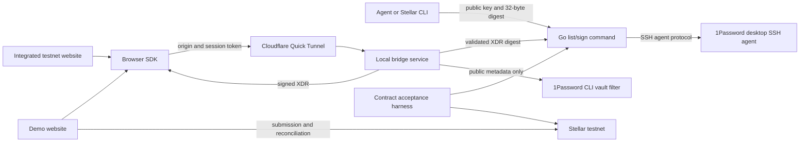

# Architecture and audit boundaries

The audit uses revision `40d6cca9db732a0db16d154c80d4a153bf33c6b7`.

## Separate responsibilities

| Layer | Responsibility | Deliberate limit |
|---|---|---|
| Go signer | List public identities and sign one digest | It cannot inspect transaction effects from a digest. |
| Bridge | Validate supported testnet XDR and return signatures | It does not build or submit transactions. |
| Tunnel supervisor | Publish and recover temporary service transport | It does not repeat signing or submission. |
| Browser SDK | Connect, select wallets, request signatures, and manage cancellation | A website integration remains necessary. |
| Demo | Build, review, submit, and reconcile example transactions | Its behavior does not define every external website. |
| Contract harness | Exercise selected account formats and protocol behavior | Fixture compatibility does not imply universal account support. |
| Installation | Build and install a coherent service release | Installed state requires separate checks from source state. |

## Authority boundaries

The connection code grants a website a temporary capability.
The website approves supported testnet requests by sending them.
The optional bridge review hook permits another policy, but the default requires no terminal approval.
1Password controls key use. Its cached approval can permit later requests without another prompt.
The local signer verifies returned Ed25519 signatures independently.
The demo owns submission recovery. The bridge never submits transactions.
Cancellation can withhold a result. It cannot undo an already produced signature.

## Evidence boundaries

The frozen source contains tracked files only.
Existing dependencies and CAP-71 build artifacts support the offline test run.
The audit records their role separately from source provenance.
The baseline suite passed 224 Bun tests and three contract self-tests.
The Go race tests, Go vet, and TypeScript check also passed.
All 30 native Rust fixture tests passed across four locked offline workspaces.
Live 1Password checks, public tunnels, physical mobile checks, and testnet writes remain not_run for this audit.
