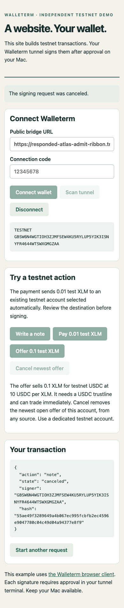
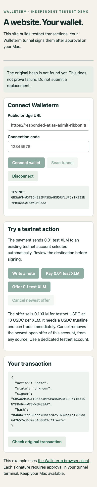
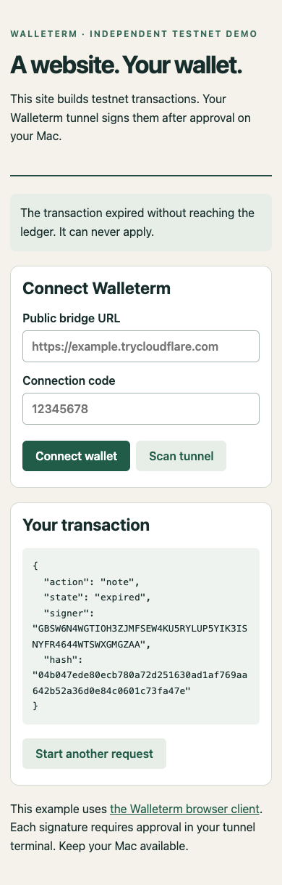

# Public demo browser test: 2026-09-25

The current test used commit `3bf7810772fc3314261c8dd0f445ade6d150b192` and installed release `e6fcee89b5894e2003aad4c3`.
Commit `7078f67` later added evidence files without changing the tested browser or bridge code.
The browser opened the demo through a Cloudflare Quick Tunnel.
The browser connected to a separate bridge tunnel with the dedicated testnet key `GBSW6N4WGTIOH3ZJMFSEW4KU5RYLUP5YIK3ISNYFR4644WTSWXGMGZAA`.
The report excludes connection codes and browser capabilities.

## Current build results

The current build had zero confirmed critical, high, medium, or low issues in the tested browser flows.

| Browser action | Transaction hash | Ledger | Result |
| --- | --- | ---: | --- |
| Write a note | `8b7ae9c9a671dfd26bd2aca465cb43691cc8f491eed25a4b8bcfd24cb4e77e03` | 4871770 | `SUCCESS` |
| Pay 0.01 test XLM | `4a7746cb193bd218dce29ba9e8ab590d65feb7499ed6d9812a2a459d0b19137e` | 4871780 | `SUCCESS` |
| Offer 0.1 test XLM | `88d79afc0c3b6484167dc02eccd3920cc2bf9d84efef5914d1418f4dacf6d248` | 4871788 | `SUCCESS`; offer `826626` appeared |
| Cancel newest offer | `79c0cd80b0f56948ae01defb50a8398d8641d748ab12478efe9ac95db56ae5c1` | 4871797 | `SUCCESS`; offer `826626` disappeared |

The browser showed the payment destination before signing.
The tunnel terminal showed the same destination, amount, signer, network, and transaction hash.
Each successful browser action required its own typed terminal challenge.
The bridge verified each returned signature before the browser enabled submission.
Horizon showed no open offer after the cancellation.
The browser console and page error log were empty during the current run.
The axe-core WCAG 2 A and AA audit found zero violations and zero incomplete checks.
The current browser rejected an incorrect code and accepted the next valid code.
The terminal denied a note without producing a signature.
The browser canceled another pending note, and the terminal ended its review without signing.
The current build passed 56 bridge tests and `go test ./...`.

## Recovery test

The current browser signed a note with hash `04b047ede80ecb780a72d251630ad1af769aa642b52a36d0e84c0601c73fa47e`.
The browser went offline before submission.
The page marked the result `unknown` and blocked another action.
After reconnection, a hash check reported `NOT_FOUND` and kept the action blocked.
The transaction time bound is `2026-09-26T00:32:45Z`.
The page retained the hash and blocked another action after reload.
A later ledger closed at `2026-09-26T00:33:37Z`.
The account sequence stayed at `20897180558557282`, below the transaction sequence `20897180558557283`.
The next hash check marked the transaction `expired` and allowed a new request.

## Setup and earlier build

The dedicated account lacked a testnet USDC trustline.
The offer button stopped before signing and explained this requirement.
Stellar CLI 27.1.0 interpreted `--limit 10` as 10 units of `0.0000001` USDC.
The resulting limit was `0.0000010` USDC.
The CLI then used `--limit 100000000` to set a `10.0000000` USDC limit.
Both trustline changes reached successful testnet ledgers.
Their hashes were `709ef86a6431874c29d50842d666f671cf2abca7086387aea00b0849661a99aa` and `4690fa39110178c0194397aba93d06e62eb45e0c217c7de4589c14f25d8d099a`.

An earlier installed release, `1a2e278cf9286322015388e8`, served the first browser run.
That run tested empty form handling, camera denial with manual entry, wallet selection, denial, cancellation, reload, invalid code, disconnect, and all four actions.
The earlier build kept an offline submission marked `unknown` after its time bound.
Commit `3bf7810` added a ledger and sequence check for this case.
The current browser test verified that correction after the new time bound.

## Limits

Headless Chrome denied camera access, so the live QR scan remains untested.
The browser showed the manual URL and code path after camera denial.
The test did not create a new 1Password key or exercise Friendbot funding.
The test did not observe a new 1Password desktop prompt.
Cached 1Password approval can explain that result.
The shell had no `HERDR_ENV=1` context, so the requested Herdr Astra review remains pending.
